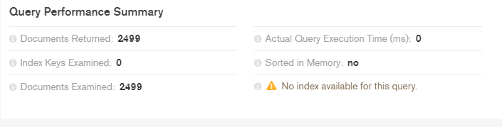
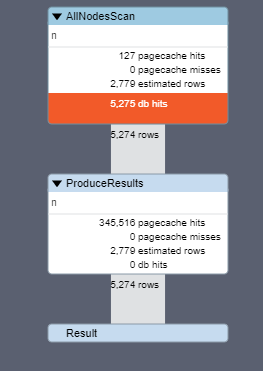
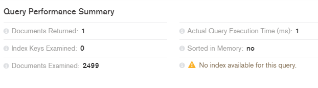
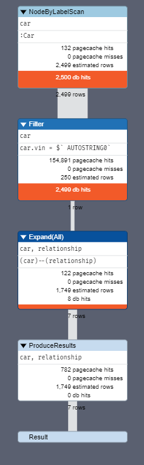

# Mini-project 2 - NOSQL - Database

### Group members:
* Rasmus Jarnborg Friis
* Mohammad Hariri
* Andreas Guldborg Heick

<br>

# Chosen databases and their features

We chose to look at MongoDB and Neo4j, a document database and a graph database.

## MongoDB - Document DB
### Key features of MondoDB
* MongoDB can store the documents in open standard BSON format (Binary JavaScript Object Notation). With BSON format MongoDB can extract the data with extreme speed and without the requirement of conversions of the internal code. However, BSON document format may take more storage space than JSON format

* CouchDB only leverages JSON format. Though BSON consumes more space to store the data, it’s speed and ability traverse the data back and forth, makes MongoDB as a choice for many organizations dealing with petabyte scale of documents or text-based data. MongoDB can be retrieved through several programming languages such as Java, C, C++, Ruby, C#, and Python. BSON format is highly compatible for most of the programming languages, than doing conversions on JSON file formats

* MongoDB supports dynamic queries when compared with CouchDB without requiring the database format to be fixed in some schema before running the query. CouchDB can only support regular queries

* MongoDB can index the documents to speed up the query extraction time. This will aid to accelerate the execution time on the database. MongoDB can also build geospatial indexes for location-based data

* Most of the databases maintain multi-version concurrency control for the consumers to visualize different versions of the data to avoid any further updates to the data while other updates are in progress. CouchDB maintains versioning of the database. MongoDB adopts the technique information-in-place with instant writes to the database

* MongoDB stores the binary data up to 4 MB with GridFS approach per document

* MongoDB performs replication of the data with master-slave architecture ensuring there is only database with eventual consistency

* MongoDB has the auto-sharding capabilities by performing the resplitting and recombination of the data

* MongoDB can perform map and reduce functions by mapping and filtering all the documents that meet particular criteria and finally processes the data for reduction

<br>

## Neo4J - Graph DB
### Key features of Neo4j

* J in Neo4J stands for Java

* It requires Java development kit (JDK) to run Neo4j

* It can be installed on Windows, Linux, and Unix operating systems

* Neo4j comes with web browser utility tool to provide data visualization and other features such as speed

* The browser can also display the relationships between the data models and graphs. It also provides options for configuration settings

* Cypher is the interactive query language in Neo4j that is much similar to structured query language for performing database operations

* Data modeling can be architected in Neo4j. The differences between entity-relationship model and Neo4j data modeling are, in an entity relationship model there are entities, relationships, and attributes, whereas in Neo4j, there are nodes, relationship, and properties 

* Neo4j has all or nothing approach to transactional commits and rollbacks when performing the database operations. It completely updates the database or it does not update at all to keep the integrity and consistency of the software

* SQL database operations such as INSERT, CREATE, SELECT, UPDATE, SET, DELETE, ORDER BY, SKIP, LIMIT, MATCH, and WHERE clause can be leveraged

* Neo4j supports importing data from the external sources

* Neo4j supports the development environments of .NET, Java, PHP, Python, Ruby, and Spring Data Neo4j

<br>

## Key differences
* Both Neo4j and MongoDB are NoSQL databases. However, Neo4J is a graph database and MongoDB is a document database

* MongoDB is schemaless and provides holistic view of the data with eventual consistency with update information-in-place principle

* MongoDB has aggregate framework, and Neo4J does not have aggregate framework

* Graph database like Neo4J comply ACID framework with complete fine-grained atomicity of the transactions

* MongoDB provides flexibility, high scalability in a distributed environment. Therefore it requires eventual consistency of the database than instant ACID compliance

* MongoDB does not create relationships between the database models, as each data set stored in the document store of the database is disaggregated and independent. A graph system requires handling the complex relationship of the database, while NoSQL database does not require handling the complex associations between the data models

* Neo4J enables navigation through the graphs as a tree, where MongoDB cannot provide visualization of the document stores as graphs

<br>

## NoSQL database type use cases
With the advent of the NoSQL movement, businesses of all sizes have a variety of modern options from which to build solutions relevant to their use cases.

* Calculating average income? Ask a relational database.
* Building a shopping cart? Use a key-value Store.
* Storing structured product information? Store as a document.
* Describing how a user got from point A to point B? Follow a graph.

<br>

# Preparing and loading the dataset

We used this dataset:

https://www.kaggle.com/doaaalsenani/usa-cers-dataset#USA_cars_datasets.csv

It contains car data that was scraped from AUCTIONEXPORT.com. This dataset included Information about 28 brands of clean and used vehicles for sale in US. 
Twelve features were assembled for each car in the dataset

It was exported as CSV from Kaggle, imported into MongoDB as CSV then exported from MongoDB in JSON format and imported in Neo4J as JSON like this:

```cypher
CALL apoc.load.json("file:///cars.json")
YIELD value
MERGE (p1:Car {id: value.id})
SET
p1.condition = value.condition,
p1.mileage = value.mileage,
p1.price = value.price,
p1.title_status = value.title_status,
p1.vin = value.vin
MERGE (p2:Brand {brand: value.brand})
MERGE (p1)-[:BRAND_OF]->(p2)
MERGE (p3:Model {model: value.model})
MERGE (p1)-[:MODEL_OF]->(p3)
MERGE (p4:Country {country: value.country})
MERGE (p1)-[:FROM_COUNTRY]->(p4)
MERGE (p5:State {state: value.state})
MERGE (p1)-[:FROM_STATE]->(p5)
MERGE (p6:Year {year: value.year})
MERGE (p1)-[:FROM_YEAR]->(p6)
MERGE (p7:Color {color: value.color})
MERGE (p1)-[:IS_COLOR]->(p7)
MERGE (p8:Lot {lot: value.lot})
MERGE (p1)-[:FROM_LOT]->(p8)
```


We separated most of the common relationships as separate nodes, to see and analyze these relationships. Something MongoDB can't do for us.

The Car node only contains unique info, though it isn't completely unique most of the time.

<br>


# Comparison

## Query speed comparison:
## How long does it take to get the whole dataset?

MongoDB
```js
db.collection("cars").find({})
```



<br>

Neo4J
```cypher
PROFILE
MATCH (n) RETURN n
```



Cypher version: CYPHER 3.5, planner: COST, runtime: COMPILED. 5275 total db hits in 23 ms.

<br>

## How long does it take to get the car with vin '3fa6p0lu2kr207325' and all it's properties?

MongoDB
```js
db.collection("cars").find(
{
    'vin': '  3fa6p0lu2kr207325'
})
```



<br>

Neo4J
```cypher
PROFILE
MATCH (car:Car {vin: '  3fa6p0lu2kr207325'})-[]-(relationship)
RETURN car, relationship
```


Cypher version: CYPHER 3.5, planner: COST, runtime: COMPILED. 5007 total db hits in 179 ms.

<br>

### Storage space comparison:
## How much storage space does the database use?

MongoDB: 697.4 KB

Neo4J: 21.80 MiB

<br>

## How much storage space does each document/node approximately consume?

MongoDB: 285.8 B

Neo4J: ??

<br>


# Results and conclusion

We are not sure why Neo4J is so much slower than MongoDB, but we think it has something to do with how we treated the data in Neo4J. Neo4J should be much faster, but it has a lot more data to look through because of the relationships. And this dataset isn't really for Neo4J, because the relations are so common and there aren't many paterns to look into.

<br>

I also think there is a difference in how each measures speed, because how they measure storage space is also different. It's generally quite hard to compare, because they are useful for different types of data and the dataset we used favors MongoDB.

MongoDB is meant for large amounts of data and scalability, so it's good as a storage for the data.
It also allows you to work quite comfortably with projects based on programming languages such as javascript, react, typescript, C#. 

MongoDB's performance is much better with the type of technologies that handle very logical, similar terms of programming. If we use languages like java php, for example, it is better to work with relational databases like postgres or mySql.

<br>

Neo4J is used to analyze and look at relations, it's very well suited for storing graph types relationship information, such as a group of people and their relationships. Data modeling this sort of information in a traditional SQL database is a pain and inefficient.

Using Neo4J allows for efficient modeling of data while providing rich querying capabilities using Cypher. Its also a great fit for any programming language because of its support for REST API.

It's less appropriate for any other data structure other than Graph data. So as with any DB, evaluate the data structure and query and if the querying revolves around relationships, then Neo4J is a fit. If there is more need for looking up individual nodes and their associated information, Neo4J might not be the most efficient solution in the market.

Neo4J would be of use if we had to analyze the relationships further, and if they contained more data.
 

<br>

So we can see that the data probably was best suited for MongoDB, and we can see that MongoDB uses far less storage space than Neo4J. But Neo4J wasn't meant to be used as a huge database, it's for analysis, so it does it's job.

Basically we can see that for this dataset MongoDB would be the better choice for storing and querying, but if we wanted to look at the data more analytically we could use Neo4J as a helper while storing the data in MongoDB.

<br>


