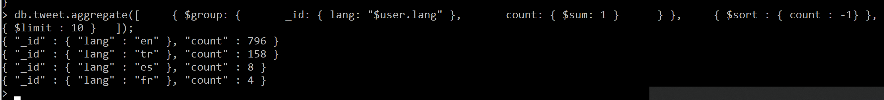
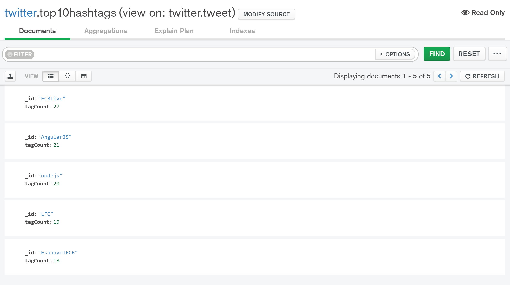

# Big Data Analytics - Exercise Sheet MongoDB (5 points).

## Team #IkkeForLangt

#### Exercise:	Sharding	in	MongoDB	
* What is sharding in mongoDB?

Sharding is a method for distributing data across multiple machines. MongoDB uses sharding to support deployments with very large data sets and high throughput operations.
<br><br>

* What are the different components required to implement sharding?

    A MongoDB sharded cluster consists of the following components:

    * shard: Each shard contains a subset of the sharded data. As of MongoDB 3.6, shards must be deployed as a replica set.

    * mongos: The mongos acts as a query router, providing an interface between client applications and the sharded cluster.

    * config servers: Config servers store metadata and configuration settings for the cluster. As of MongoDB 3.4, config servers must be deployed as a replica set (CSRS).
<br><br>

* Explain architecture of sharding in mongoDB?

The following graphic describes the interaction of components within a sharded cluster:


MongoDB shards data at the collection level, distributing the collection data across the shards in the cluster.
<br><br>

From https://docs.mongodb.com/manual/sharding/
<br><br>

#### Exercise:	MapReduce	with	mongoDB	(warmup)	
As a first exercise you are required to load reddit data from the link mentioned in 2). With help of map and reduce you
need to find top 10 “lang” (language) of the documents in reddit.

### a) Provide implementation of map and reduce function

### b) Provide execution command for running MapReduce

### c) Provide top 10 recorded out of the sorted result. (hint: use sort on the result returned by MapReduce)

We might be a bit confused but we can't find any reddit data, and the assignment used twitter earlier?
We don't see why we would use map reduce here, when aggregate does the job?

And since we couldn't find the reddit data, we used the tweets which do exist and have languages. Problem is that the twitter data only has 5 languages, so a top 10 makes no sense

```js
db.tweet.aggregate([
    {
        $group: {
            _id: { lang: "$user.lang" },
            count: { $sum: 1 }
        }
    },
    {
        $sort: {
            count: -1
        }
    },
    { $limit: 10 }
]);
```




#### Exercise:	MapReduce	with	mongoDB	(hashtag	query)	(5 points)	
For this task you need to download twitter dataset from the link mentioned in 2). This time you have to answer query
“what are the top 10 hashtags used in the given tweets”. To answer this you need to use MapReduce. You can look at
the scheme of the collection using db.collection.findOne(). It will print one record with scheme information. Also you
can use function like this.hasOwnProperty(‘field_name’) to check if a field exist in the record. (if the field does not exist
you will get error.

### a) Provide implementation of map and reduce function

### b) Provide execution command for running MapReduce

### c) Provide top 10 recorded out of the sorted result. (hint: use sort on the result returned by MapReduce)

Again we don't see why we should use mapreduce when aggregate is so much easier

```js
db.tweets.aggregate([
    { $unwind: '$entities.hashtags' },

    {
        $group: {
            _id: '$entities.hashtags.text',
            tagCount: { $sum: 1 }
        }
    },

    {
        $sort: {
            tagCount: -1
        }
    },

    { $limit: 5 }
]);
```


