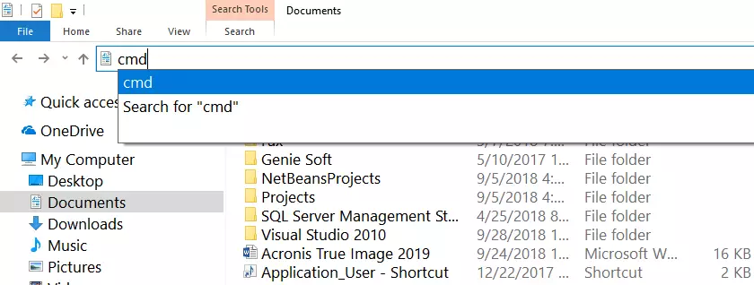

# Postgres 

## POSTGRESQL 9.1.12 - DATABASE BACKUP AND RESTORATION


#### OPEN CMD in directory where the export file is located!
#### USE CMD NOT POWERSHELL OR GIT BASH!

1. Go to your desired folder and click on the location bar of Windows Explorer.

2. Then type cmd and press Enter key.

3. The command prompt will be opened in the folder.



<br>

## DUMP DATABASE:

<br>
user = postgres

db_name = existing database

databaseExport.sql = name of dumped/expoted database file

```bash 
pg_dump -U user db_name > databaseExport.sql
```
EXAMPLE:
```bash 
pg_dump -U postgres 7dbs > databaseExport.sql
```
put the user password and press enter.

Now 7dbs is exported as sql!

<br>

## RESTORE DATABASE:

<br>
Create a new database which we will import the dumped one into

```bash 
createdb 7dbs2
```

user = postgres

new_db_name = the new database name (7dbs2)

databaseExport.sql = name of dumped/expoted database file

```bash 
psql -U user new_db_name < databaseExport.sql
```
EXAMPLE:
```bash 
psql -U postgres 7dbs2 < databaseExport.sql
```
put the user password and press enter.

<hr>